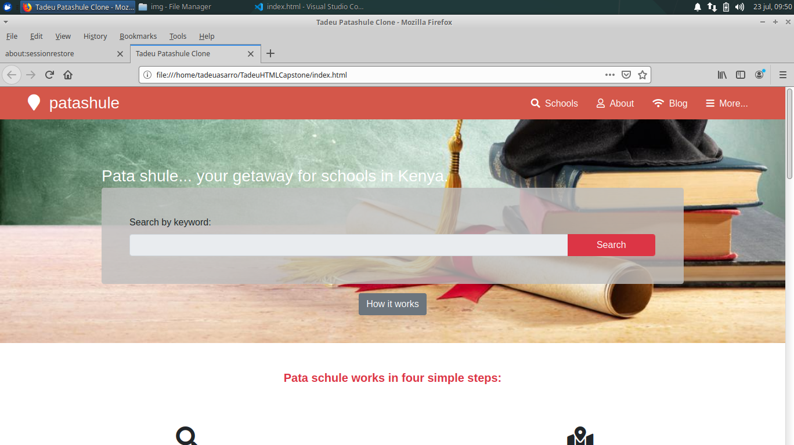

# HTML Capstone

Hey there! In this project the main objective was to work on the front-end, by creating a responsive website of [this project right here](https://www.behance.net/gallery/25563385/PatashuleKE)

To accomplish this work, it was used HTML5, CSS3 and Bootstrap. Most of the elements were created with a combination of CSS and Bootstrap. Except the footer element, which was created with pure CSS.

## Built With

- HTML5
- CSS3
- Bootstrap 4

## Live Demo

[Live Demo Link](https://rawcdn.githack.com/tadeuasarro/TadeuHTMLCapstone/f8daacf4340cd700765fbfbd0293394d6cf191da/index.html)

## Authors

#### This project design belongs to these guys:
- [Mathew Njuguna](https://www.behance.net/mathewnjuguna)
- [Sam Anchola](https://www.behance.net/aweSam)

#### This is me:

👤 Tadeu Sarro

- Github: [@tadeuasarro](https://github.com/tadeuasarro)
- Twitter: [@tadeuasarro](https://twitter.com/tadeuasarro)
- Linkedin: [@tadeuasarro](https://www.linkedin.com/in/tadeu-sarro-71481013a/)

## 🤝 Contributing

Contributions, issues and feature requests are welcome!

Feel free to check the [issues page](https://github.com/tadeuasarro/TadeuHTMLCapstone/issues)

## Show your support

Give a ⭐️ if you like this project!

## Acknowledgments

- Mathew Njuguna
- Sam Anchola
- Behance
- GitHub
- Microverse
- TheOdinProject

## 📝 License

This project is open licensed.
